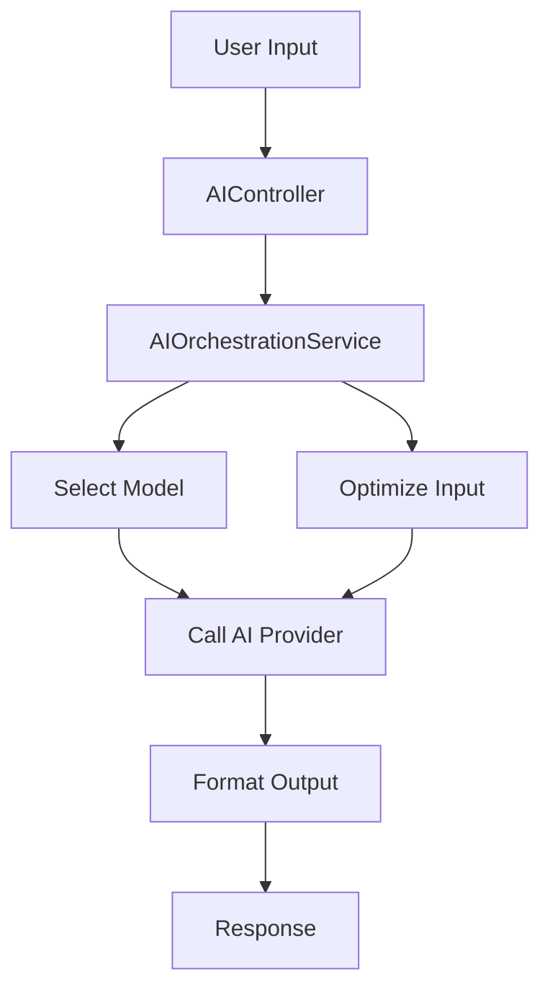

# AI Services Documentation

This document provides an overview of the AI services implemented in the ALICE Pro platform.

## Table of Contents
- [Overview](#overview)
- [Architecture](#architecture)
- [Services](#services)
  - [AIOrchestrationService](#aiorchestrationservice)
  - [AIOptimizationService](#aioptimizationservice)
- [Usage](#usage)
  - [Basic Usage](#basic-usage)
  - [API Endpoints](#api-endpoints)
- [Configuration](#configuration)
- [Extending the Services](#extending-the-services)

## Overview

The AI services provide a flexible and extensible way to interact with various AI models and providers. The system is designed to:

1. **Optimize Input**: Preprocess and enhance user input for better AI understanding
2. **Route Requests**: Select the most appropriate AI model based on the task
3. **Format Output**: Present AI responses in a user-friendly manner
4. **Handle Errors**: Provide meaningful error messages and fallbacks

## Architecture



## Services

### AIOrchestrationService

The main service that coordinates between different AI providers and handles request routing.

**Key Features:**
- Model selection based on task type and requirements
- Input optimization and preprocessing
- Response formatting and post-processing
- Error handling and fallback mechanisms

### AIOptimizationService

Handles input optimization and output formatting to improve AI interactions.

**Key Features:**
- Input analysis and preprocessing
- Context enhancement
- Response formatting based on content type
- Support for multiple optimization strategies

## Usage

### Basic Usage

```php
use App\Facades\AI;

// Process input with AI
$response = AI::process(
    input: "How do I create a new Laravel project?",
    context: ['framework' => 'Laravel'],
    inputType: 'text'
);

// Optimize input
$optimized = AI::optimizeInput(
    input: "Create a blog post about AI",
    taskType: 'content_creation',
    context: ['tone' => 'professional']
);

// Format output
$formatted = AI::formatOutput($aiResponse, 'narrative');
```

### API Endpoints

#### Process Input

```
POST /api/ai/process
```

**Request Body:**
```json
{
    "input": "How do I create a new Laravel project?",
    "context": {
        "framework": "Laravel"
    },
    "type": "text"
}
```

**Response:**
```json
{
    "content": "To create a new Laravel project...",
    "format_type": "narrative",
    "suggested_actions": ["create_project", "show_documentation"]
}
```

#### List Available Models

```
GET /api/ai/models
```

**Response:**
```json
{
    "models": {
        "openai": {
            "driver": "openai",
            "models": ["gpt-4", "gpt-3.5-turbo"]
        },
        "anthropic": {
            "driver": "anthropic",
            "models": ["claude-3-opus", "claude-3-sonnet"]
        }
    },
    "default": "openai"
}
```

## Configuration

Configuration is handled in `config/ai.php`:

```php
return [
    'default' => env('AI_PROVIDER', 'openai'),
    
    'providers' => [
        'openai' => [
            'driver' => 'openai',
            'api_key' => env('OPENAI_API_KEY'),
            'model' => env('OPENAI_MODEL', 'gpt-4'),
        ],
        // Other providers...
    ],
    
    'optimization' => [
        'enabled' => env('AI_OPTIMIZATION_ENABLED', true),
        'cache_ttl' => 3600,
    ],
];
```

## Extending the Services

### Adding a New AI Provider

1. Create a new provider class in `app/Services/Providers/`
2. Implement the `AIModelProvider` interface
3. Register the provider in the service container

### Adding Optimization Strategies

1. Add a new method to `AIOptimizationService`
2. Register it in the `$optimizationStrategies` array
3. Reference it in the appropriate optimization preset

## Best Practices

1. Always use the `AI` facade instead of directly instantiating services
2. Provide meaningful context with each request
3. Handle errors gracefully and provide fallbacks
4. Cache expensive operations when possible
5. Monitor API usage and costs

## Troubleshooting

### Common Issues

1. **API Key Issues**: Ensure your API keys are set in the `.env` file
2. **Rate Limiting**: Implement retry logic for rate-limited requests
3. **Model Availability**: Check that the requested model is available in your plan
4. **Input Size**: Be aware of token limits for different models

### Debugging

Enable debug mode in your `.env` file:

```
AI_DEBUG=true
```

This will provide more detailed error messages and logging.
